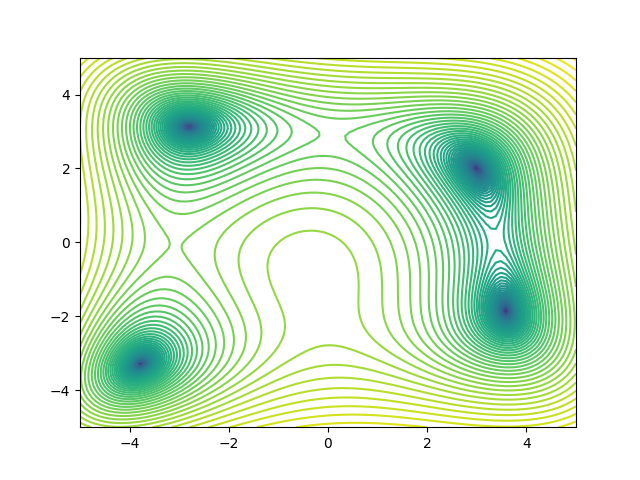

# Particle Swarm Optimization (PSO) for Function Minimization

This repository contains an implementation of Particle Swarm Optimization (PSO) to find the minima of a given objective function. The specific function used in this example is a well-known test function in optimization.

## Overview

Particle Swarm Optimization (PSO) is a population-based optimization algorithm inspired by the social behavior of birds flocking or fish schooling. The algorithm optimizes a problem by iteratively trying to improve candidate solutions with respect to a given measure of quality.

## Objective Function

The objective function used in this implementation is:

f(x, y) = (x^2 + y - 11)^2 + (x + y^2 - 7)^2

## Files

- `PSO.py`: Contains the complete implementation of the PSO algorithm and all necessary functions.

## Functions

### AdjustVelocities

Adjusts the velocities of particles based on their previous velocities, personal best positions, and the global best position.

### PlotContour

Plots the contour of the objective function over a specified range.

### SetInitialPositions

Sets the initial positions of the particles randomly within given bounds.

### SetInitialVelocities

Sets the initial velocities of the particles randomly within given bounds.

## Usage

1. **Clone the repository**:
    ```bash
    git clone https://github.com/Nekros0day/Particle-Swarm-Optimization.git
    cd Particle-Swarm-Optimization
    ```

2. **Install the necessary dependencies**:
    ```bash
    pip install numpy matplotlib
    ```

3. **Run the PSO algorithm**:
    ```bash
    python PSO.py
    ```


## Initial Contour Plot



## Dependencies

- numpy
- matplotlib

Install the dependencies using:
```bash
pip install numpy matplotlib
